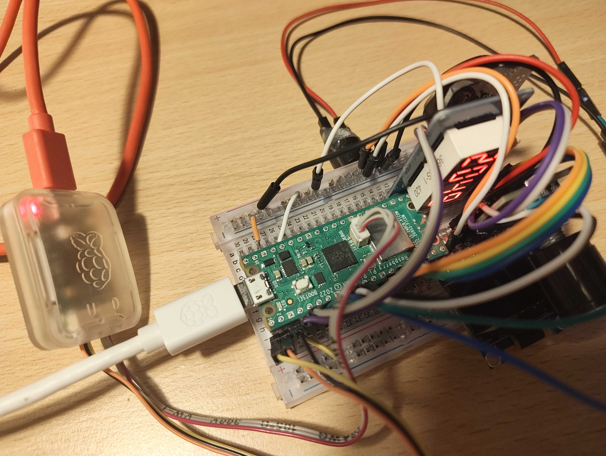

# Raspberry Pi Pico Clock

[Demo Video](https://cdn.hackclub.com/019f8b51-9054-7245-af8b-34d2946238d0/vid_20260722_210821007.mp4)

<!-- TODO: Video Demo -->

## Bill of Materials

* Raspberry Pi Pico WH - ca. €7
* DS3231 RTC Module - ca. €2
* TM1637 4-Digit 7-Segment Display Module - ca. €2
* Buzzer - ca. €2
* Rotary Encoder - ca. €2
* 0.96" OLED Display - ca. €2
* Jumper Wires and Breadboard - ca. €5

Total cost: ca. €20

## How to use

1. Install Visual Studio Code and the Pico Extension on your computer.
2. Clone this repository, and open it in Visual Studio Code.
3. Initialize submodules by running `git submodule update --init --recursive` in the terminal.
4. Connect the components according to the circuit diagram above.
5. Build and upload the program to the Raspberry Pi Pico.
6. You can now use the clock!
